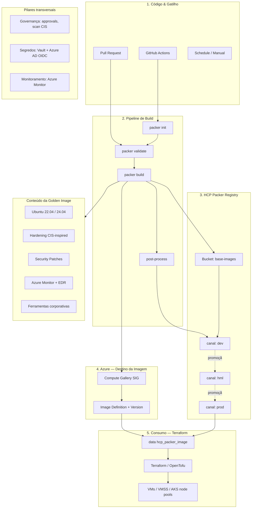

# Arquitetura — Image Factory Azure

Versão **Azure-only** do diagrama `arquitetura.jpeg` (escopo deste teste).

## Visão geral



## Etapas numeradas (conforme diagrama)

| # | Etapa | Implementação neste repo |
|---|-------|--------------------------|
| 1 | Código & Gatilho | GitHub Actions (`push`, `PR`, `workflow_dispatch`) |
| 2 | Pipeline de Build | `packer init` → `validate` → `build` → `post-process` |
| 3 | HCP Packer Registry | Bucket `base-images`, canais `dev` / `hml` / `prod` |
| 4 | Criação de Imagem Azure | Publicação na **SIG** (Compute Gallery) |
| 5 | Consumo IaC | `data.hcp_packer_image` + Terraform (`examples/`) |
| 6-7 | Distribuição | Replicação SIG em múltiplas regiões |
| 8 | Monitoramento | Azure Monitor Agent na imagem + logs do pipeline |

## O que vai dentro da imagem

Conforme o diagrama de referência:

- **SO base**: Ubuntu 22.04 ou 24.04 LTS
- **Hardening CIS-inspired**: SSH, UFW, Fail2ban, Auditd, sysctl, PAM
- **Security patches**: unattended-upgrades
- **Agentes**: Azure Monitor Agent, EDR (placeholder configurável)
- **Ferramentas**: Azure CLI, Docker, Node Exporter, Lynis/AIDE

## Canais HCP Packer (promoção)

```
Build CI ──► dev ──(validação)──► hml ──(homologação)──► prod
```

- **dev**: builds automáticos da branch `develop`
- **hml**: promoção manual após testes
- **prod**: builds da branch `main` ou promoção aprovada

## Pilares de governança (roadmap)

| Pilar | Status | Próximo passo |
|-------|--------|---------------|
| Azure AD OIDC | Implementado no workflow | Federated credentials |
| HCP WIF | Implementado no workflow | Service Principal HCP |
| Vault para secrets | Planejado | Integrar `hcp-auth` + Vault Secrets |
| Scan CIS/OWASP | Planejado | Lynis no build + Defender for Cloud |
| Image signing | Planejado | Notation/Cosign na SIG |
| Sentinel/OPA | Planejado | Policy checks no promote |

## Diferença do diagrama original

O diagrama `arquitetura.jpeg` cobre **multicloud** (Azure + AWS + OCI).  
Este projeto de teste implementa **somente Azure**:

- Destino: Azure Compute Gallery (SIG)
- Autenticação: Azure AD OIDC
- Monitoramento: Azure Monitor
- Consumo: Terraform + `hcp_packer_image` (platform = `azure`)

## Referência visual

Diagrama original: [`arquitetura.jpeg`](../arquitetura.jpeg)
